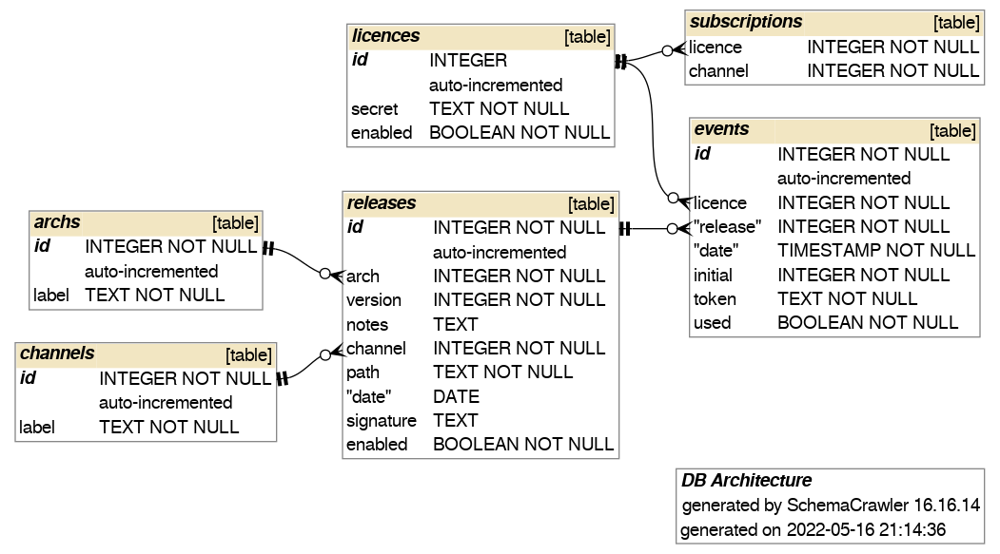

# Tauri Update Server
A minimalistic implementation of a server to integrate auto-updating functionality on tauri applications.  
It is meant to support user licences and channels to constrain and track the available updates.  

This is a prototype.  
Functionality is not fully there yet, but as of now it should be working.  
No interface to update the db from here, just for content delivery.  

## Usage
`yarn add @taus-services/taus` to install the node server, or `npm install @taus-services/taus`.
You can reference [this](https://github.com/KaruroChori/taus-example) other repository to have a working example.

## Custom headers
In addition to the general structure provided by *tauri update*, there are three more fields which are used to define proper conditions for delivery:

- `licence` is a unique identifier for the user requesting the update. Internal checks can be performed to prevent download of content to suspect licences shared against terms&conditions.
- `channel` is used to specify the channel from which the update must be served. For example `beta`, `stable`, `trial` etc.
- `suggested` is the target version which I would like to be served. The server itself does not have to fulfill such request.

Both `licence` and `channel`, if not populated, can be automatically assigned to a default value specified as part of the server configuration.


## Configuration
The behaviour of the server can be changed via a configuration object.
- **port**: the port to
- **db**: the configuration object for Sequelize.
- **default_channel**: the default value for channel if client is not specifying a custom header for it.
- **default_secret**: same for the licence.
- **fastify**: an object for the fastify configuration (https etc.)
- **storage**: `base` and `protocol` for the storage entry point. Base must be a single directory token.
- **update**: same but for the update entry point on the server.
A default configuration is used in case no custom one has been provided. 1st level children are interpolated:

```
const default_config = {
    host: 'localhost',
    port: 8000,
    db: {
        dialect: 'sqlite',
        storage: './example/db'
    },
    default_channel: 'free',
    default_secret: 'free-licence',
    fastify: {},
    storage: {
        protocol:"http",
        base:"/s/"
    },
    update: {
        protocol: "http",
        base:"/u/"
    }
}
```

If you need you can also specify custom DB schema generated with sequelize-auto as `dbSchema`, but keep in mind that the codebase for the server might need to be changed from you as well.

## TODO
- Accept suggestions from the client for a specific version.
- ~~Provide CLI via a separate tool to push new releases on the server.~~ via an external tool [TAUS-CLI](https://github.com/KaruroChori/taus-cli)
- Custom callbacks for some of the failure events.
- ~~Async checks on the db to tag licences which are cheating.~~ via external tools

## ER Schema

