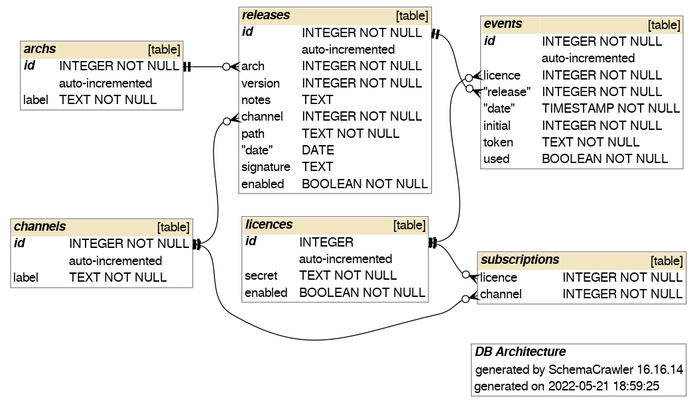

# Tauri Update Server
A minimalistic implementation of a server to integrate auto-updating functionality on tauri applications.  
It is meant to support user licences and channels to constrain and track the available updates.  

This is a prototype.  
Functionality is not there yet, but as of now it should be working.  
No interface to update the db from here, just for content delivery.  

## Usage

- `yarn start` to start the node server.
- `yarn db-auto` to automatically generate models for the database `./private/db`.

## Custom headers
In addition to the general structure provided by *tauri update*, there are three more fields which are used to define proper conditions for delivery:

- `licence` is a unique identifier for the user requesting the update. Internal checks can be performed to prevent download of content to suspect licences shared against terms&conditions.
- `channel` is used to specify the channel from which the update must be served. For example `beta`, `stable`, `trial` etc.
- `suggested` is the target version which I would like to be served. The server itself does not have to fulfill such request.

Both `licence` and `channel`, if not populated, can be automatically assigned to a default value specified as part of the server configuration.

## Usage
There is some data stored on the db for the sake of testing.  
Visiting `localhost:8000/update/linux-amd64/0` a json file will be returned, with a one-time token which can be used to download the pointed file.  
In the public repository the referenced file does not exist, an error code will be returned instead.

## TODO
- Accept suggestions from the client for a specific version
- Provide CLI via a separate tool to push new releases on the server
- Async checks on the db to tag licences which are cheating.

## ER Schema

